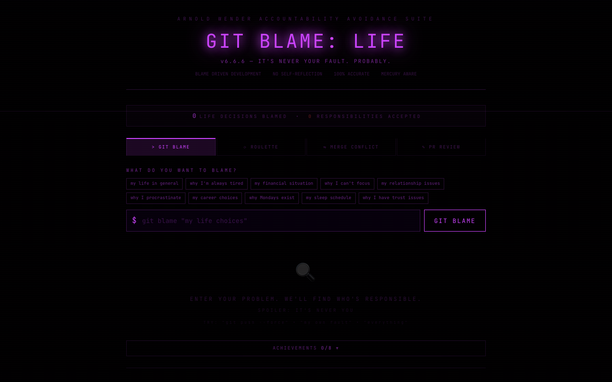

# :detective: Git Blame Life

**Git blame but for your life decisions. Find out who's really responsible.**

Built by [Arnold Wender](https://arnoldwender.com)

[](https://git-blame-life.netlify.app)

---



## What is this?

Ever wondered who committed that terrible life decision? Git Blame Life applies version control concepts to your actual life. Spin the blame roulette wheel, review your life's pull requests, navigate merge conflicts between your ambitions and reality, and try (unsuccessfully) to revert your worst decisions.

> ```
> git blame life.txt
> a3f7d2 (Mom, 1995-09-14) Signed you up for accordion lessons
> b8e1a9 (You, 2019-03-22) "I'll just have one more coffee at 11pm"
> c2d4f6 (Past You, 2024-01-01) New Year's resolution: wake up at 5am
> ```

## Features

- **Blame Roulette Wheel** — Spin to find out who's responsible for your life choices
- **Life Timeline** — A git log of your most questionable decisions
- **Merge Conflicts** — When your plans and reality can't be reconciled
- **PR Reviews** — Your life decisions reviewed by brutally honest reviewers
- **Revert Button** — Try to undo your worst decisions (spoiler: it never works)
- **Achievements** — Unlock badges for blaming the right people
- **GitHub Contribution Graph** — A full 52x7 heatmap showing your life's most blame-worthy weeks
- **Repository Insights Dashboard** — Stats and analytics for your life repo's commit history
- **Fake Changelog** — Version history of your life's most regrettable patches
- **Pro Tier** — Premium blame features for the truly committed
- **Expanded Tab Navigation** — Multi-panel interface for deep-diving into your life's git history

## Tech Stack

| Technology | Purpose |
|---|---|
| React 18 | UI framework |
| TypeScript | Type safety |
| Vite | Build tool & dev server |
| Tailwind CSS | Styling |
| Framer Motion | Animations |
| canvas-confetti | Celebration effects |
| html2canvas | Share card generation |
| Web Audio API | Sound effects |
| Lucide React | Icons |

## Getting Started

```bash
# Clone the repo
git clone https://github.com/arnoldwender/git-blame-life.git
cd git-blame-life

# Install dependencies
npm install

# Start dev server
npm run dev

# Build for production
npm run build
```

## Live Demo

**[https://git-blame-life.netlify.app](https://git-blame-life.netlify.app)**

## Contributing

Want to blame someone for this project's code? Check out [CONTRIBUTING.md](./CONTRIBUTING.md) for guidelines on how to get involved.

## License

This project is licensed under the MIT License — see the [LICENSE](./LICENSE) file for details.
